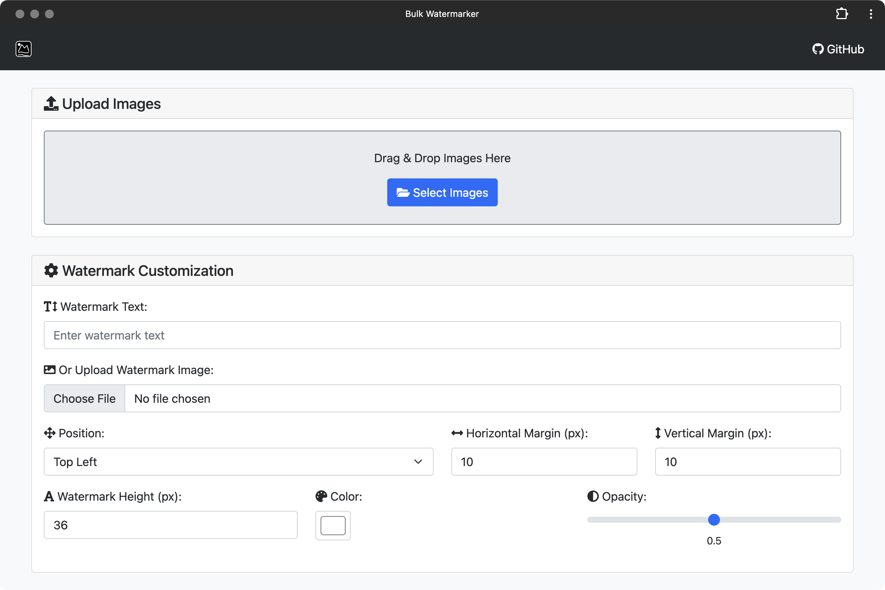

 

<h2 align="center">
<a href="https://watermarker.oncornerstone.app">Bulk Watermarker</a>
</h2>

This repository hosts a simple web-based application for adding watermarks to multiple images simultaneously. It supports both text and image watermarks and offers customization options such as position, font size, color, opacity, and margins. The application is built using Bootstrap and vanilla JavaScript.

## Features

- **Bulk Processing**: Upload multiple images and apply watermarks to all of them at once.
- **Watermark Customization**:
  - **Text Watermarks**: Add custom text as a watermark.
  - **Image Watermarks**: Upload an image to use as a watermark.
  - **Position**: Choose from top-left, top-right, center, bottom-left, or bottom-right.
  - **Font Size**: Adjust the size of the watermark text or image.
  - **Color**: Select the color of the text watermark.
  - **Opacity**: Set the transparency level of the watermark.
  - **Margins**: Define horizontal and vertical margins for precise positioning.
- **Live Preview**: View changes in real-time with the live preview canvas.
- **Responsive Design**: Built with Bootstrap for a responsive and user-friendly interface.
- **Download Options**:
  - Download individual images with watermarks.
  - Download all processed images as a ZIP file.
- **Settings Persistence**: Automatically saves your settings to local storage for convenience.

## Usage

1. **Upload Images**:
   - Drag and drop images into the upload area.

     

   - Or click the "Select Images" button to browse and select images from your device.

2. **Customize Watermark**:
   - **Watermark Text**: Enter the text you want to use as a watermark.
   - **Or Upload Watermark Image**: Choose an image file to use as the watermark.
   - **Adjust Settings**:
     - **Position**: Select where the watermark should appear on the images.
     - **Font Size**: Set the size of the watermark text or image.
     - **Color**: Pick a color for the text watermark.
     - **Opacity**: Use the slider to adjust the transparency.
     - **Margins**: Specify horizontal and vertical margins for positioning.

     

3. **Live Preview**:
   - The live preview canvas updates automatically as you adjust settings.

     

   - Click on the live preview to download the current image with the applied watermark.

4. **Processed Images**:
   - Scroll down to see all processed images with pagination.

     

   - Click on any thumbnail to update the live preview with that image.
   - Use the "Download" link on each image to save individual files.

5. **Download All Images**:
   - Click the "Download All as ZIP" button to download all watermarked images in a ZIP archive.

## License

- The code in this repository is licensed under the MIT License - see the [LICENSE](LICENSE) file for details.